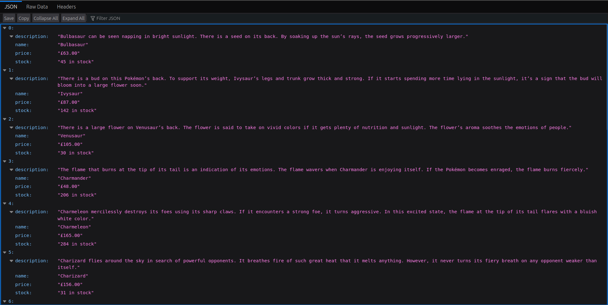

### To start the docker container run the following command:
```bash
sudo docker compose -f docker_compose.yaml up -d
```
After starting the docker container, kafka and zookeeper will be configured and a new topic called my-topic will be created automatically.

After that the producer container will run and scrape the first page from [This Website](https://scrapeme.live/shop/) and send it to the kafka topic that was created.

Then the consumer container will run and receieve the data and save it in a json file located in a shared volume between its container and the API container.

Lastly the api container will run making the data accessible at http://localhost:8501/data.



## Some useful Kafka cli commands

### To enter the Kafka container run the following command:
```bash
sudo docker exec -it kafka /bin/sh
```

### To create a container run the following command:
```bash
kafka-topics --create --topic my-topic --bootstrap-server localhost:9092 --replication-factor 1 --partitions 1
```

### To send a message to the topic via Kafka Producer run:
```bash
kafka-console-producer --topic my-topic --bootstrap-server localhost:9092
```

### To read messages from the topic via Kafka Consumer run:
```bash
kafka-console-consumer --topic my-topic --bootstrap-server localhost:9092 --from-beginning
```
